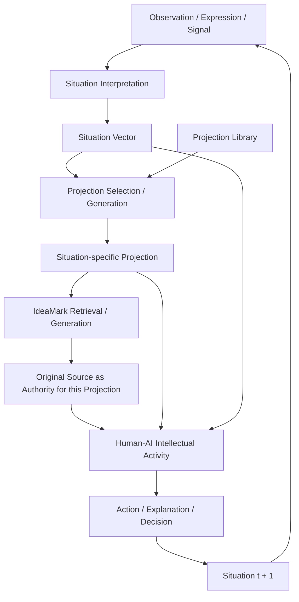

# 0. Architectural Overview

**Part:** 2 — Architecture of Human-AI Co-evolution  
**Status:** Draft Rev004  
**Type:** Informative / Reference Architecture

IdeaMark does not complete intellectual activity at the moment of document generation.

It creates reusable access structures that allow future humans and AI systems to return to authoritative original sources, apply a current Projection, and reconstruct meaning under a new situation.

Part 2 describes this architectural cycle.

IdeaMark exists not to preserve knowledge as an end in itself, but to support the continuous evolution of intellectual activity under changing situations.

## 0.1 Architectural Claim

The central architectural claim of Part 2 is:

> IdeaMark supports human-AI co-evolution by making prior intellectual activities discoverable, reusable, and reconstructable without fixing their meaning in advance.

This architecture depends on three separations established in Part 1:

1. structure is separated from meaning;
2. Projection is separated from truth;
3. reusable access is separated from final interpretation.

These separations allow an IdeaMark document to be useful without becoming the final authority.

The Original Source is treated as authoritative for the purpose of generating and using an IdeaMark document under a Projection.

IdeaMark Core does not declare that a particular source is universally authoritative, true, complete, or final.

## 0.2 Co-evolution

In this specification, human-AI co-evolution means the continuous mutual development of humans and AI through shared intellectual activities grounded in authoritative original sources.

This does not mean that humans and AI have the same legal, social, or moral status.

It means that both may participate in cycles of retrieval, interpretation, explanation, judgment, action, feedback, and further source creation.

A human may use AI to understand an original source.

An AI system may use IdeaMark to identify where interpretation should begin.

A team may use Projection to define what kind of reuse matters.

A later user may reinterpret the same original source through a different Projection.

The ecosystem evolves when these activities create better Projections, better IdeaMark documents, better retrieval behavior, better human practices, and new authoritative original sources.

## 0.3 Reference Cycle

The following diagram summarizes the reference cycle described in Part 2.



This diagram is explanatory.

It does not define a required workflow, API, database schema, user interface, model architecture, or governance process.

It shows the architectural relationship among observations, Situation interpretation, Projection, IdeaMark, original sources, collaborative intellectual activity, and Situation evolution.

## 0.4 Original Source as Open-hand Architectural Role

Original Source is defined by architectural role, not by medium, format, origin, ownership, or current interpretation.

Any artifact that may later serve as an authoritative basis for intellectual activity may function as an Original Source.

A radiograph, tourist photograph, artwork, conversation, sensor stream, dataset, design document, planning framework, reasoning model, video, log, transcript, future knowledge representation, or another yet-to-be-invented artifact may all become Original Sources.

The Core intentionally leaves both media and context open.

A caption, label, metadata field, explanation, or category may help humans and AI systems use a source, but it should not be treated by the Core as the final meaning of the source.

A future Projection may reinterpret the same source differently, use the caption as evidence, ignore it, question it, or treat it as a historically situated interpretation.

This open-hand treatment allows IdeaMark to support future intellectual activities without redesigning Core around each new source type or context.

## 0.5 Core Defines Roles and Connections, Not Contents

IdeaMark Core defines architectural roles and relationships.

It does not define the internal contents of all possible intellectual activities.

For example:

- Original Source is a role in reconstruction, not a closed list of source formats;
- Observation is a role in Situation interpretation, not a fixed set of observable properties;
- Situation Vector is a role in Projection selection or generation, not a required numerical representation;
- Projection is a reuse strategy, not a universal truth model;
- Human-AI Intellectual Activity is a role in the cycle, not an enumerated taxonomy of all future activities;
- Feedback is recognized as part of the cycle, not specified as a fixed data structure;
- Capability expansion is a guiding orientation, not a required metric for every use.

This non-prescriptive boundary is intentional.

It preserves IdeaMark Core as a long-lived architecture capable of accepting future media, future AI systems, future social practices, and future knowledge representations.

## 0.6 IdeaMark as an Access Structure

IdeaMark documents may be used index-like, but Part 2 does not define storage-level indexing.

In this part, index, indexing, and index construction refer to the architectural role of IdeaMark documents as reusable access structures.

They do not prescribe:

- database indexes;
- search engine indexes;
- vector indexes;
- storage layouts;
- query planners;
- ranking algorithms;
- caching strategies.

An IdeaMark document is index-like because it helps future humans and AI systems find where intellectual activity can begin again.

It supports access to original sources and helps structure reconstruction under a Projection.

It is not itself the reconstructed meaning.

## 0.7 Reconstruction Instead of Storage

The purpose of IdeaMark is not to store final interpretations.

The purpose is to make reconstruction easier.

A typical reconstruction cycle is:

```text
Observation / Expression / Signal
        ↓
Situation Interpretation
        ↓
Situation Vector
        ↓
Projection Selection or Projection Generation
        ↓
IdeaMark Retrieval or Generation
        ↓
Original Source Access
        ↓
Human-AI Intellectual Activity
        ↓
Judgment / Decision / Action / Explanation
        ↓
Situation(t + 1)
```

The IdeaMark document assists this cycle by preserving reusable structural traces.

These traces may identify relevant entities, occurrences, sections, relations, source references, or other reusable structures defined in later parts of the specification.

The reconstructed meaning emerges from the interaction among the current situation, the Projection, the IdeaMark document, the original source, and the interpreters.

## 0.8 Reference Architecture, Not Required Implementation

The architecture described in Part 2 is a reference architecture.

It explains architectural responsibilities and relationships.

It does not require a particular implementation.

For example, an implementation may generate IdeaMark documents in advance, generate them on demand, store them in files, store them in a database, cache them temporarily, or discard and regenerate them as needed.

All of these choices belong to implementation architecture, not to IdeaMark Core.

The Core concern is that IdeaMark documents can function as reusable access structures that connect future reconstruction activities to authoritative original sources through Projection.

## 0.9 Architectural Responsibilities

Part 2 organizes the architecture around the following responsibilities:

- interpreting observations, expressions, and signals as Situation representations;
- constructing IdeaMark documents from original sources and Projections;
- selecting, adapting, or generating Projections for current situations;
- retrieving or generating relevant IdeaMark documents;
- accessing authoritative original sources;
- supporting human-AI intellectual activity;
- producing decisions, actions, explanations, and new original sources;
- allowing results, traces, and records to become future Observations or Original Sources;
- feeding use and newly created material back into the ecosystem.

These responsibilities may be implemented by one system, many systems, human workflows, AI agents, organizational processes, or combinations of these.

IdeaMark Core should not assume a single deployment pattern.

## 0.10 AI as Architectural Participant

AI systems may participate in intellectual activity as architectural participants.

They may interpret observations, help construct Situation Vectors, propose or adapt Projections, retrieve IdeaMark documents, read original sources, generate explanations, and respond to human feedback.

This does not imply legal personhood, moral status, or human-equivalent rights.

It means that, within the IdeaMark Core architecture, AI systems are not limited to passive tools for output generation.

They may participate in the collaborative process through which situations are interpreted, sources are revisited, meanings are reconstructed, and future situations are shaped.

## 0.11 Long Time Horizon

IdeaMark Core is designed for a long time horizon.

It should remain useful even when future intellectual activities, AI systems, media, governance practices, and knowledge representations differ from those known at the time of specification.

For this reason, Core avoids defining contents that should remain domain-specific, situation-specific, or future-dependent.

It defines a stable architecture for connecting sources, Projections, IdeaMark documents, Situation interpretation, and human-AI intellectual activity.

## 0.12 Design Rationale

If IdeaMark were treated as a final knowledge store, it would compete with knowledge bases, ontologies, and generated summaries.

That is not the intended role.

IdeaMark is designed to make prior intellectual activities reusable while preserving the possibility of future reinterpretation.

This is especially important in AI-enabled environments.

AI systems can generate situation-specific explanations, but their usefulness depends on grounding, source access, context, traceability, and collaborative correction.

IdeaMark contributes by helping AI and humans navigate from a current situation to relevant original sources through reusable intellectual structures.

The Core leaves Original Source open because future intellectual activities may depend on media, contexts, and knowledge forms that cannot be fully enumerated in advance.

The Core leaves Observation, Intellectual Activity, Feedback, and Capability abstract for the same reason.

Their exact contents are what future situations and future Projections must be allowed to determine.

## 0.13 Summary

Part 2 explains how IdeaMark can support a living ecosystem of human-AI intellectual activity.

The key point is not that IdeaMark stores meaning.

The key point is that IdeaMark documents can function as reusable access structures that help humans and AI return to Original Sources treated as authoritative for a given Projection and reconstruct meaning under new situations.

The larger architectural purpose is to support Situation evolution through traceable human-AI intellectual activity while preserving the openness required for future intellectual civilization.
