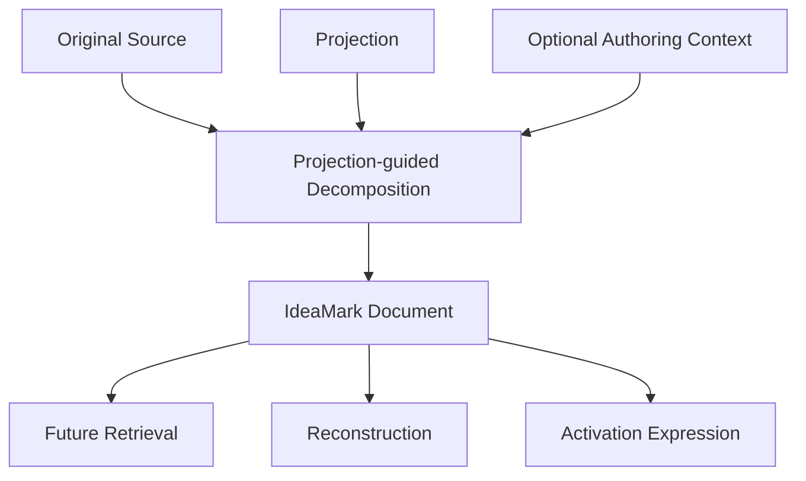
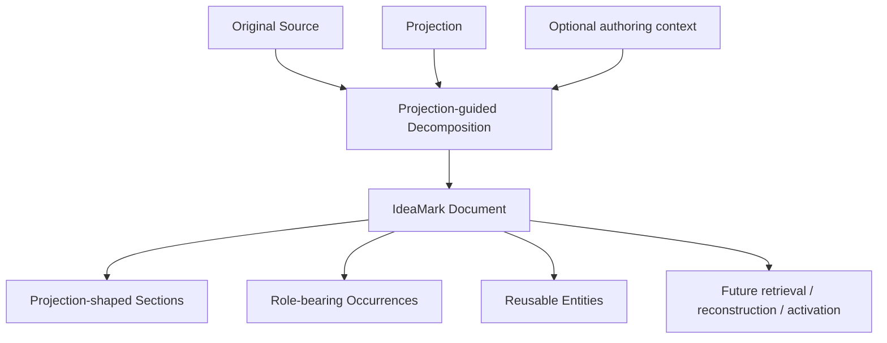
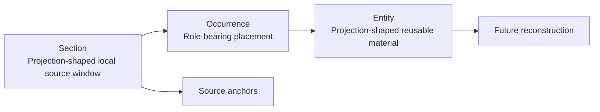
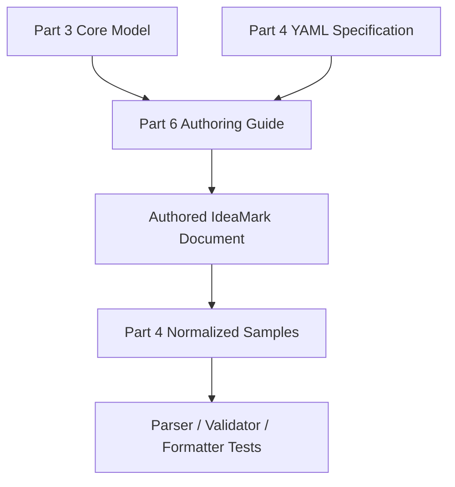

# 0. Authoring Guide Overview

**Version:** IdeaMark Core v1.2.0  
**Status:** Draft

## 0.1 Purpose

Part 6 explains how humans, AI systems, and authoring tools can create useful IdeaMark documents.

It translates the conceptual model from Part 3 and the YAML representation from Part 4 into practical authoring guidance.

Part 6 is not a normative Core schema.

It should not introduce new required fields, new required namespaces, or new validation rules unless those requirements are also added to Part 4.

## 0.2 Diagram Convention

Diagrams in Part 6 SHOULD be written as Mermaid diagrams inside Markdown code blocks.

This keeps diagrams reviewable in plain text, renderable on GitHub, and easy to maintain alongside the specification.

Example:

## 0.3 Authoring Stance

IdeaMark authoring is Projection-guided decomposition.

An author does not merely summarize an Original Source.

An author selects or creates a Projection, reads the Original Source through that Projection, and produces reusable access structures that support future reconstruction and meaning activation.

## 0.4 What Authoring Produces

A practical IdeaMark authoring process produces:

- source references;
- Projection references or inline Projection notes;
- Projection-shaped Sections;
- role-bearing Occurrences;
- reusable Entities;
- source anchors and traceability notes;
- optional structure ordering;
- review notes, status values, and versioning metadata when useful.

It does not need to produce final meaning.

It does not need to store every possible interpretation of the source.

It does not need to solve all future retrieval tasks.

## 0.5 Relationship to Part 3

Part 3 defines the Core Model concepts:

- Section as a Projection-shaped local source window;
- Occurrence as a role-bearing placement of reusable material;
- Entity as Projection-shaped reusable material.

Part 6 explains how to make those modeling decisions in practice.

## 0.6 Relationship to Part 4

Part 4 defines the concrete YAML representation.

Part 6 uses the Part 4 representation but does not replace it.

When this guide gives YAML examples, they should follow the Part 4 array-based object representation.

## 0.7 Relationship to Part 5

Part 5 defines Projection itself.

Part 6 explains how an author uses a Projection during authoring.

When a Projection decision becomes complex, reusable, versioned, or governed, it should be moved to Part 5-style Projection documents or Projection Library material.

## 0.8 Relationship to Part 4 Samples

Part 4 normalized samples provide implementation-oriented YAML examples.

Part 6 should explain why those samples were authored that way.

For example:

- why the heapq performance sample chooses performance-oriented Sections;
- why the heapq API design sample decomposes the same source differently;
- why the recipe cooking sample and recipe substitution sample produce different Entity kinds;
- why `relations` is not required for the initial samples.

## 0.9 Intended Readers

Part 6 is intended for:

- human authors;
- AI authoring agents;
- prompt designers;
- reviewers;
- CLI and editor UX designers;
- sample corpus authors;
- teams creating domain-specific profiles.

## 0.10 Authoring Guide Boundary

Part 6 may recommend practices.

Part 6 may describe common mistakes.

Part 6 may propose review loops and quality checks.

Part 6 must not silently redefine Core conformance.

If a practice should become mandatory, it must be promoted to Part 4 or a profile specification.
