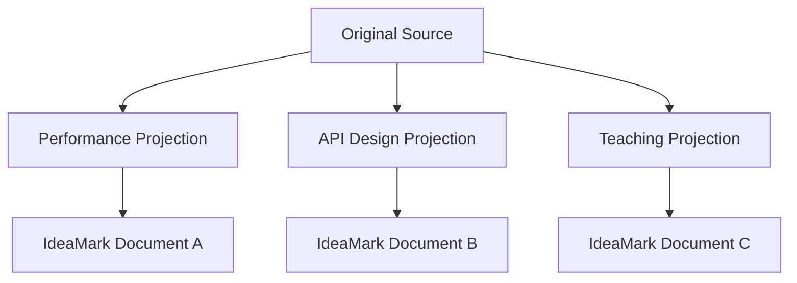

# 2. Selecting or Creating a Projection

**Version:** IdeaMark Core v1.2.0  
**Status:** Draft

## 2.1 Purpose

A Projection defines the way an Original Source is read for a future knowledge reuse activity.

The authoring process should begin by selecting, creating, or at least sketching a Projection.

Without a Projection, authoring tends to become generic summarization, indexing, or ontology construction.

With a Projection, the author can decide what should become reusable material, how Sections should be organized, and what future reconstruction should be supported.

## 2.2 Projection Is a View for Reuse

A Projection is not merely a topic label.

It is a view that shapes reuse.

For the same source, different Projections may produce different Sections, Occurrences, and Entities.



## 2.3 When to Select an Existing Projection

Use an existing Projection when:

- the future activity is already known;
- a similar document has already been authored;
- consistency across documents is important;
- samples, profiles, or test corpora already exist;
- implementation tooling expects a known Projection pattern.

Examples:

- performance engineering for source code;
- API design reasoning for source code;
- cooking execution for recipes;
- ingredient substitution for recipes;
- design rationale extraction for RFC-like prose.

## 2.4 When to Create a New Projection

Create a new Projection when the intended reuse activity is meaningfully different from existing ones.

A new Projection may be appropriate when:

- the future user asks a different kind of question;
- the source must be decomposed at a different granularity;
- the useful Entity material has a different form;
- Section boundaries would change substantially;
- search, reconstruction, or review needs are different;
- the activity belongs to a new domain or profile.

A new Projection does not need to be fully formal at the beginning.

A short inline Projection note may be enough for early authoring.

## 2.5 Minimal Projection Sketch

For practical authoring, a minimal Projection sketch should answer:

```yaml
projection:
  purpose: what future activity should this support?
  intended_activity:
    - what should a future human or AI do with the document?
  audience:
    - who or what is expected to reuse it?
  focus:
    - what kinds of source material should be noticed?
  non_goals:
    - what should be intentionally ignored?
```

This is not a required Core object shape.

It is an authoring aid.

Part 4 defines how Projection references and inline notes appear in YAML.

Part 5 defines Projection more fully.

## 2.6 Projection and Omission

A Projection authorizes useful omission.

The author should not attempt to extract everything.

Instead, the author should ask:

- Is this material reusable under the Projection?
- Will omitting it harm the intended future activity?
- Is it outside the non-goals?
- Would including it make the document less reusable by adding noise?

Omission is acceptable when it improves focus.

Omission becomes a problem when it hides material required for reconstruction, review, or trust.

## 2.7 Projection and Granularity

Projection controls granularity.

For example, a recipe source may be decomposed differently:

| Projection | Likely Entity granularity |
|---|---|
| Cooking execution | one step, timing rule, or heat-control rule |
| Ingredient substitution | one ingredient function or substitution target |
| Shopping preparation | one shopping item or prep task |
| Beginner teaching | one explanation or mistake-prevention point |

The author should avoid assuming that the source itself determines the correct unit.

The Projection determines the useful unit for reuse.

## 2.8 Projection Drift

Projection drift occurs when an author starts with one intended reuse activity but gradually includes material for another.

For example, a performance engineering Projection may drift into general code documentation.

A cooking execution Projection may drift into cultural explanation or nutritional analysis.

Projection drift is not always wrong, but it should be visible.

Possible responses include:

- tighten the Projection;
- split the document;
- add a second Projection;
- mark some material as out of scope;
- move the work to a profile or companion document.

## 2.9 Human-AI Use

Humans and AI systems may both propose, revise, or critique Projections.

A human may provide the intended reuse activity and ask an AI to draft a Projection.

An AI may infer an implicit Projection from examples and ask for confirmation.

A reviewer may later discover that the produced Sections do not match the Projection and request regeneration.

Part 6 does not assign Projection selection exclusively to humans or AI systems.

## 2.10 Authoring Checks

Before drafting Sections, check:

1. Is the intended future activity clear enough?
2. Are non-goals explicit enough to prevent generic summarization?
3. Would two authors using the Projection likely notice similar source material?
4. Would a different Projection produce a meaningfully different document?
5. Is the Projection lightweight enough for the current authoring stage?

If the answer to these questions is unclear, the author may still proceed, but the document should remain draft or exploratory.
