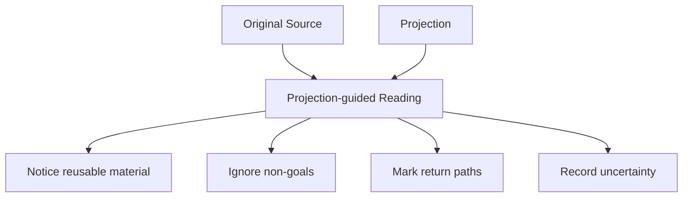

# 3. Reading Original Sources

**Version:** IdeaMark Core v1.2.0  
**Status:** Draft

## 3.1 Purpose

Reading an Original Source for IdeaMark authoring is not the same as reading it for comprehension, quotation, or summary.

The author reads the source through a Projection in order to design reusable access structures.

This means the author should notice not only what the source says, but also how future humans or AI systems may return to it, reuse it, and reconstruct activity-specific meaning from it.

## 3.2 Projection-guided Reading

The Projection should guide attention.

A performance Projection may notice comparison counts and implementation rationale.

An API design Projection may notice user-facing behavior and edge cases.

A recipe execution Projection may notice step order and heat control.

A recipe substitution Projection may notice ingredient functions.

## 3.3 Read for Reuse, Not Coverage

Authoring does not require complete coverage of the Original Source.

The author should read for reusable material that supports the intended future activity.

Useful reading questions include:

- Which source regions would future users need to revisit?
- Which details are reusable beyond this exact source?
- Which statements are evidence, constraints, procedures, examples, or warnings under the Projection?
- Which source regions support more than one possible Section?
- Which material should be intentionally ignored?

## 3.4 Preserve Source Identity

The author should preserve source identity before decomposing the source.

At minimum, this means recording enough information to identify the source again.

Depending on the source type, this may include:

- URI;
- repository path;
- revision or commit;
- document title;
- edition or version;
- media type;
- generated source ID;
- local file name;
- checksum or content hash when needed.

Precise source identity supports trust, review, migration, and regeneration.

## 3.5 Anchor at the Right Precision

Source anchors should be precise enough for the intended future use.

They do not need to be more precise than necessary.

Possible anchor precision levels include:

- document-level;
- heading path;
- line range;
- paragraph;
- code symbol;
- table row;
- image region;
- timestamp;
- inferred context;
- approximate region.

An audit profile may require stronger anchors than Core mode.

A draft authoring process may start with approximate anchors and refine them later.

## 3.6 Reading Non-text Sources

Original Sources may include non-text material.

Examples include:

- images;
- diagrams;
- audio;
- video;
- binary files;
- structured data;
- sensor logs;
- model outputs;
- code repositories;
- databases.

For non-text sources, the author should distinguish between:

- the source material itself;
- a textual description of the source;
- a generated interpretation;
- a reference to a region, timestamp, object, or binary payload.

An Entity may refer to binary material, but the source relationship should remain clear.

## 3.7 Record Uncertainty

Authors should not hide uncertainty by inventing exact structure.

If source reading is incomplete or uncertain, record that uncertainty through notes, status values, approximate anchors, or review markers.

Examples:

- anchor precision is approximate;
- source region is inferred from context;
- OCR or transcription may be unreliable;
- source revision is unknown;
- domain interpretation requires human review;
- a source region may support multiple competing Projections.

Uncertainty is acceptable in a working artifact when it is visible.

## 3.8 Avoid Source Flattening

Source flattening occurs when the author converts the source into a generic list of points before applying the Projection.

This loses the local structure needed for future reconstruction.

For example, turning a code file into a list of functions may miss design rationale encoded in comments, ordering, or edge-case handling.

Turning a recipe into a list of ingredients may miss timing, transformation, or substitution relationships.

The author should preserve enough source context for Sections to remain meaningful local activity units.

## 3.9 Multiple Passes Are Normal

Reading may occur in multiple passes.

For example:

1. Identify source identity and broad regions.
2. Apply the Projection and mark candidate Sections.
3. Identify candidate Entities and Occurrences.
4. Revisit anchors and traceability.
5. Review omissions and uncertainties.
6. Regenerate or refine the document.

Not every authoring task requires every pass.

The authoring process should be as lightweight or as rigorous as the intended reuse requires.

## 3.10 Authoring Checks

Before moving from reading to modeling, check:

1. Is the Original Source identifiable?
2. Is the Projection guiding what is noticed?
3. Are important source regions traceable enough?
4. Are non-goals preventing unnecessary extraction?
5. Is uncertainty visible rather than hidden?
6. Does the reading preserve enough context for local activity units?
