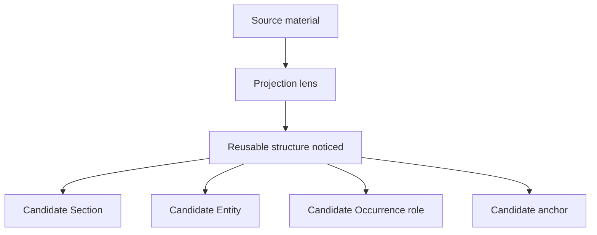
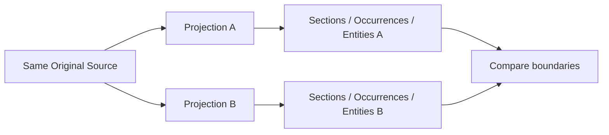

# 4. Identifying Reusable Intellectual Structures

**Version:** IdeaMark Core v1.2.0  
**Status:** Draft

## 4.1 Purpose

IdeaMark authoring identifies reusable intellectual structures rather than merely extracting facts or summarizing prose.

A reusable intellectual structure is source-derived or source-related material that can support future human-AI activity under a Projection.

It may later become a Section, Occurrence, Entity, anchor, note, or optional extension object.

## 4.2 Reusable Does Not Mean Universal

Reusable material does not need to be universally useful.

It only needs to be useful for the intended future activity under the Projection.

For example:

- a comparison-count comment may be reusable under a performance Projection;
- the same comment may be irrelevant under an API design Projection;
- kombu may be a cooking step under an execution Projection;
- kombu may be an umami source under a substitution Projection.

The author should not ask whether the material is important in general.

The author should ask whether it is reusable under this Projection.

## 4.3 Common Structure Types

Reusable intellectual structures may include:

- invariant;
- constraint;
- procedure step;
- decision point;
- rationale;
- evidence;
- assumption;
- warning;
- exception;
- dependency;
- comparison;
- transformation;
- function or role;
- substitution target;
- boundary condition;
- open question;
- review checkpoint.

These are authoring concepts, not required Core vocabularies.

Core allows open role and kind values.

Profiles may later define stricter vocabularies.

## 4.4 From Source Material to Reusable Structure

The path from source material to reusable structure is shaped by Projection.

The same source fragment may support different structures under different Projections.

The author should avoid treating the first decomposition as the only possible decomposition.

## 4.5 Activity Units Before Object Types

Before deciding whether something is an Entity, Occurrence, or Section, the author should ask what local activity it supports.

Questions:

- What will a future user do with this material?
- Does it help explain, compare, decide, execute, teach, verify, search, or regenerate?
- Does it belong to a local activity unit?
- Does it need to be reusable outside that local unit?
- Does it need a role within that local unit?

This prevents premature conversion of source material into a flat list of Entities.

## 4.6 Candidate Section Signals

Material may suggest a Section when it forms a local activity unit.

Signals include:

- it groups several related reusable materials;
- it corresponds to a step, branch, or review point;
- it has a distinct source region or source context;
- it supports a future reconstruction task;
- it creates a useful boundary for anchors;
- it can be compared with another Section under another Projection.

A Section boundary should be useful, not merely decorative.

## 4.7 Candidate Entity Signals

Material may suggest an Entity when it can be reused as material.

Signals include:

- it can appear in more than one Occurrence;
- it is useful outside one source sentence;
- it is a reusable caution, concept, function, step, evidence item, or payload;
- it should be preserved for reconstruction;
- it should be referenced by ID;
- it may be represented differently in another Projection.

An Entity may be textual or non-textual.

## 4.8 Candidate Occurrence Signals

Material may suggest an Occurrence when the same reusable material needs a role in a local activity unit.

Signals include:

- the material participates in a Section;
- the material has a local role such as evidence, warning, step, constraint, or rationale;
- the same Entity may play different roles in different Sections;
- the local placement matters for reconstruction;
- ordering matters within the Section.

Occurrence modeling is especially useful when Entity material should remain reusable while its local function changes.

## 4.9 Avoid Premature Relations

Relations can be useful, but Part 6 authoring should not require them too early.

Many initial documents can express useful structure through:

- Sections;
- ordered Occurrences;
- Occurrence roles;
- Entity kinds;
- anchors;
- optional `structure` ordering.

Add relations when the relationship itself needs to be queried, reused, validated, or exchanged.

Do not add relations merely because two things are related in natural language.

## 4.10 Multi-Projection Comparison

One of the best ways to identify reusable intellectual structures is to compare decompositions under multiple Projections.

Differences are informative.

If two Projections produce the same structure, either the source is simple, or one Projection is not strong enough to shape decomposition.

## 4.11 Authoring Checks

Before committing candidate structures, check:

1. Is each structure reusable under the Projection?
2. Is the boundary functional rather than merely semantic?
3. Is the material too broad, too narrow, or appropriately reusable?
4. Does the local activity unit need a Section?
5. Does the reusable material need an Entity?
6. Does the placement or role need an Occurrence?
7. Are relations truly needed at this stage?
