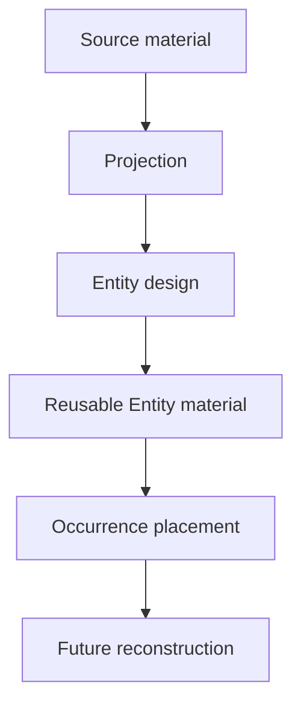
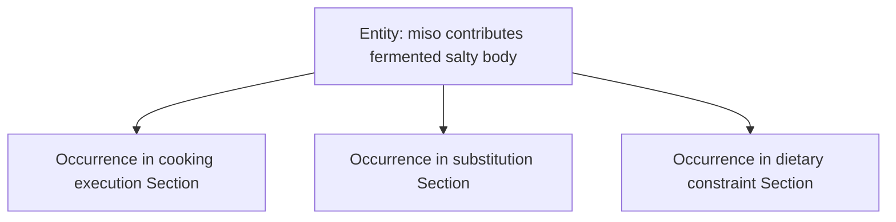

# 5. Modeling Entities

**Version:** IdeaMark Core v1.2.0  
**Status:** Draft

## 5.1 Purpose

Entity modeling decides what reusable material should be preserved for future reuse under a Projection.

An Entity is not necessarily a named object, fact, term, ontology node, or source excerpt.

An Entity is Projection-shaped reusable material.

## 5.2 Entity Is Designed, Not Merely Found

The author should not assume that Entities already exist in the source waiting to be extracted.

The source provides material.

The Projection shapes what becomes reusable.

The author designs Entities to support future reconstruction and reuse.



## 5.3 Acceptable Entity Material

Entity material may be textual or non-textual.

It may include:

- quoted source text;
- paraphrase;
- summary;
- short label;
- keyword or phrase;
- URI;
- code symbol;
- JSON fragment;
- table cell or row reference;
- image reference;
- audio or video timestamp reference;
- binary object reference;
- generated review label;
- domain-profile payload.

Core does not require all Entities to share the same material form.

Profiles may restrict material form for a specific use case.

## 5.4 Entity Granularity

Entity granularity should be chosen for reuse.

An Entity is too broad when it becomes a mini-summary that cannot be reused flexibly.

An Entity is too narrow when it cannot support reconstruction without excessive hidden context.

A useful Entity is often small enough to be reused and large enough to remain meaningful under the Projection.

## 5.5 Projection-shaped Granularity Examples

The same source material may require different Entity granularity under different Projections.

| Source material | Projection | Possible Entity |
|---|---|---|
| CPython heapq comments about comparisons | Performance engineering | comparison cost as performance driver |
| CPython heapq API functions | API design | heapreplace workload fit |
| Recipe step about kombu and bonito | Cooking execution | remove kombu before boiling |
| Same recipe step | Ingredient substitution | kombu contributes glutamate-rich umami |
| RFC drawback paragraph | Design rationale | compatibility constraint |

The author should not normalize these into one generic Entity model unless a profile requires it.

## 5.6 Entity Kind Is Advisory in Core

In Core mode, `kind` helps humans and tools interpret the Entity.

It is not a closed ontology unless a profile defines one.

Good `kind` values should be useful for authoring, review, retrieval, or validation.

Examples:

- `design_choice`;
- `constraint`;
- `failure_mode`;
- `recovery_invariant`;
- `ingredient_function`;
- `timing_constraint`;
- `mistake_prevention`;
- `substitution_target`.

The author should prefer meaningful, Projection-shaped kinds over generic labels such as `item` when possible.

## 5.7 Avoid Summary Entities by Default

Summary Entities are often too broad.

They may hide the reusable structure that IdeaMark is meant to preserve.

For example, under a performance Projection, an Entity such as:

```text
CPython heapq is optimized for performance.
```

is usually less useful than separate Entities such as:

```text
comparison operations may be expensive
```

```text
avoiding early break reduces comparisons for repeated pop workloads
```

```text
heapify uses bottom-up construction
```

However, summary Entities are not forbidden.

They may be appropriate when the Projection requires a reusable summary payload.

The author should make that decision intentionally.

## 5.8 Entity Source Relationship

An Entity may be directly quoted, indirectly derived, generated, or externally referenced.

The author should preserve enough source relationship for the intended use.

Possible relationships include:

- direct excerpt;
- paraphrase;
- inferred from a source region;
- generated label for a source region;
- external reference;
- binary payload reference;
- profile-defined transformation.

Core does not require a fixed field for every relationship type, but authoring should keep the relationship reviewable.

## 5.9 Entity Reuse Across Sections

A useful Entity may appear in multiple Sections through multiple Occurrences.

This is one reason to separate Entity from Occurrence.

Example:



The Entity remains reusable material.

Each Occurrence records a local role.

## 5.10 Entity Review Questions

Review each Entity with questions such as:

1. What future activity does this Entity support?
2. Which Projection shaped it?
3. Is it reusable outside one sentence or source position?
4. Is it too broad to reuse flexibly?
5. Is it too narrow to reconstruct meaning?
6. Does it need a clearer `kind`?
7. Does it need better traceability through Section anchors or notes?
8. Could the same material be modeled differently under another Projection?

## 5.11 When to Split an Entity

Split an Entity when it contains multiple reusable materials that may need independent roles.

Signals include:

- it combines evidence and conclusion;
- it combines procedure and rationale;
- it combines multiple constraints;
- it would need different Occurrence roles in different Sections;
- future search would need to retrieve only part of it;
- review or correction would affect only part of it.

## 5.12 When to Merge Entities

Merge Entities when they are too small to support reuse.

Signals include:

- each fragment requires the same hidden context;
- separate IDs add no retrieval value;
- reconstruction always uses the fragments together;
- splitting makes review harder without improving reuse;
- the Projection treats the material as one functional unit.

## 5.13 Authoring Checks

Before finalizing Entities, check:

1. Are Entities Projection-shaped rather than generic extractions?
2. Is each Entity reusable material?
3. Does the chosen granularity support future reconstruction?
4. Are source relationships reviewable enough?
5. Are Entity kinds useful but not over-controlled?
6. Are summary Entities used intentionally rather than by default?
