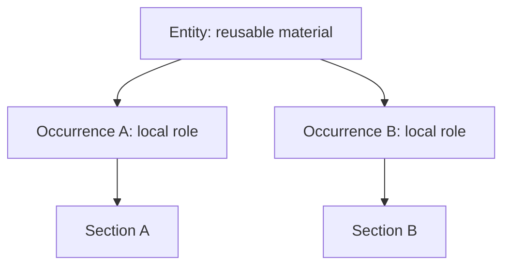

# 6. Modeling Occurrences

**Version:** IdeaMark Core v1.2.0  
**Status:** Draft

## 6.1 Purpose

Occurrence modeling decides how reusable Entity material participates in a local activity unit.

An Occurrence is not merely a textual occurrence in the Original Source.

An Occurrence is a role-bearing placement of reusable material within a Section.

It connects:

- a Section as a local activity unit;
- an Entity as reusable material;
- a role that explains local function;
- ordering or grouping when useful for reconstruction.

## 6.2 Why Occurrences Exist

Entity and Section are not enough by themselves.

An Entity may be reusable across multiple Sections.

A Section may need to use the same Entity in a specific local role.

Occurrence separates reusable material from local function.

This allows the same material to support different future activities without duplicating or redefining the Entity.

## 6.3 Occurrence Role

The role field should describe what the Entity does inside the Section.

Possible roles include:

- evidence;
- constraint;
- rationale;
- warning;
- ordered step;
- prerequisite;
- exception;
- counterexample;
- decision point;
- review point;
- reconstruction support;
- search cue;
- comparison target.

These are examples, not a closed Core vocabulary.

Profiles may define stricter role vocabularies.

## 6.4 Role Is Local

Occurrence role is local to the Section.

The same Entity may have different roles in different Sections.

For example, a recipe ingredient Entity may be:

- an execution input in a cooking Section;
- a substitution target in a substitution Section;
- an allergen flag in a dietary review Section;
- a shopping item in a preparation Section.

The Entity remains reusable material.

The Occurrence describes local use.

## 6.5 Occurrence Ordering

Occurrence ordering may matter when a Section represents a sequence, argument, dependency chain, review flow, or reconstruction path.

Ordering may be expressed through the order of Occurrence IDs in `sections[].occurrences`.

When ordering does not matter, authors should not invent a false order.

If ordering is important but unclear, mark uncertainty through notes or review status rather than making the order appear certain.

## 6.6 Occurrence Granularity

An Occurrence should be granular enough to express a useful local role.

An Occurrence may be too broad when one role hides multiple local functions.

An Occurrence may be too narrow when it creates many tiny placements that do not improve reconstruction.

Useful signals for splitting Occurrences include:

- the same Entity participates in two different local roles;
- the Section has separate steps or checkpoints;
- review would approve one placement but reject another;
- reconstruction needs one item without another;
- ordering differs between local uses.

Useful signals for merging Occurrences include:

- separate placements always appear together;
- roles are indistinguishable under the Projection;
- splitting adds no retrieval or reconstruction value;
- the local activity treats the material as one unit.

## 6.7 Occurrence Without Relation

Many authoring tasks can be modeled with Occurrences before adding explicit Relations.

If the important fact is that an Entity plays a role in a Section, an Occurrence is often enough.

Add Relations when the relationship itself must be queried, validated, exchanged, or reused independently.

Do not add Relations merely to express every natural-language connection.

## 6.8 Occurrence and Source Anchors

An Occurrence may rely on Section-level anchors.

Core does not require every Occurrence to carry its own source anchor.

However, more precise anchors may be useful when:

- the Section covers a large source region;
- the Occurrence corresponds to a specific line, phrase, cell, frame, or timestamp;
- audit or review needs require precise traceability;
- multiple Occurrences use the same Entity but different source evidence.

Authors should choose anchor precision based on intended reuse and review requirements.

## 6.9 Occurrence Notes

Occurrence notes can be useful for local rationale, uncertainty, or review guidance.

Examples:

- why the Entity is placed in this Section;
- why the local role was chosen;
- whether ordering is inferred;
- whether the placement needs human review;
- whether the role comes from a profile vocabulary.

Notes should remain distinguishable from source-derived material and final meaning.

## 6.10 Human-AI Collaboration

AI systems may be useful for proposing Occurrence roles and ordering.

Humans may be useful for checking whether the proposed local role matches the intended activity.

Tools may validate references, uniqueness, and missing Entities.

No fixed division of labor is required.

Occurrence modeling is a good review point because it reveals whether the document is merely collecting Entities or actually designing future reuse.

## 6.11 Authoring Checks

Review each Occurrence with questions such as:

1. Which Section uses this Occurrence?
2. Which Entity does it place?
3. What is the local role?
4. Does the role support the Projection?
5. Does ordering matter?
6. Is the source relationship traceable enough?
7. Would a different Section use the same Entity differently?
8. Is an explicit Relation truly needed, or is the Occurrence enough?
