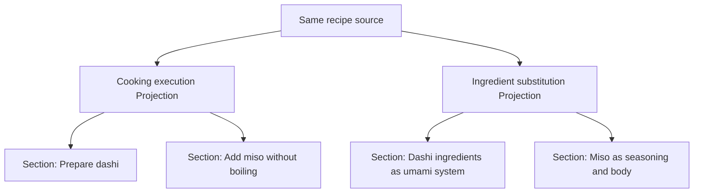
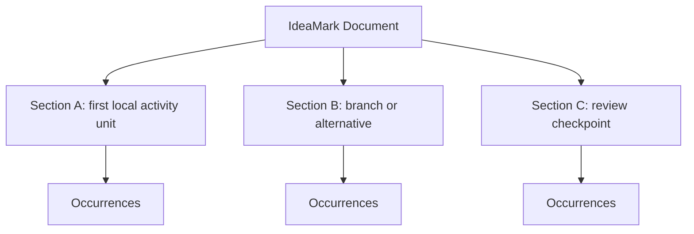

# 7. Organizing Sections

**Version:** IdeaMark Core v1.2.0  
**Status:** Draft

## 7.1 Purpose

Section organization decides how an IdeaMark Document is divided into local activity units.

A Section is not simply a source heading.

A Section is a Projection-shaped local source window that supports future reuse, reconstruction, review, or navigation.

In authoring practice, a Section can be understood as a local activity unit.

## 7.2 Section as Local Activity Unit

A local activity unit is a bounded part of the intended future intellectual activity.

It may correspond to:

- a procedural step;
- a reasoning stage;
- a decision point;
- a source region;
- a comparison target;
- a review checkpoint;
- a reusable subproblem;
- a branch in a future workflow;
- a cluster of Occurrences that should be reconstructed together.

A single IdeaMark Document usually contains multiple Sections because useful future activity is rarely a single undivided act.

## 7.3 Projection Shapes Section Boundaries

The same source may produce different Section boundaries under different Projections.

The source material may overlap.

The local activity units differ.

## 7.4 Section Boundary Signals

Material may deserve a Section when:

- it groups multiple Occurrences;
- it represents a step, stage, branch, or checkpoint;
- it gives a useful source anchor boundary;
- it supports a future retrieval or reconstruction task;
- it can be reviewed as a unit;
- it can be compared with a Section under another Projection;
- it contains reusable material that would become noisy if merged elsewhere.

A Section should make future use easier.

It should not exist only because the source has a heading.

## 7.5 Source Headings and Section Titles

Source headings are useful signals, but they should not control Section design by themselves.

A source heading may map to:

- one Section;
- multiple Sections;
- part of a Section;
- no Section;
- different Sections under different Projections.

Section titles should describe the local activity unit, not merely copy the source heading.

For example:

- `Implementation notes` may become `Comparison-cost-aware sift strategy` under a performance Projection.
- `Ingredients` may become `Dashi ingredients as umami system` under a substitution Projection.

## 7.6 Section Size

A Section is too large when it contains multiple local activity units that should be reopened, reviewed, or reconstructed separately.

A Section is too small when it cannot support a meaningful local activity or contains only a decorative boundary.

Useful questions:

- Would a future user retrieve this Section as a unit?
- Would a reviewer approve or reject it as a unit?
- Do the contained Occurrences work together?
- Does the Section need its own source anchor?
- Would splitting it improve reuse?
- Would merging it reduce unnecessary fragmentation?

## 7.7 Multi-step and Branching Activities

An intended intellectual activity may include multiple steps, branches, or alternatives.

A Section can represent one local unit inside that larger activity.

The document as a whole may support the broader activity.

Each Section should support a bounded part of that activity.

## 7.8 Section Ordering

Section ordering may support reconstruction, reading flow, execution, or review.

Ordering may be recorded in optional `structure.sections` or in another profile-defined ordering mechanism.

When ordering is not meaningful, authors should avoid implying a false order.

When ordering is uncertain, make that uncertainty visible.

## 7.9 Section Anchors

Section-level anchors are often the main return path to the Original Source.

A Section anchor should point to the source context that supports the local activity unit.

This may be:

- a line range;
- a heading path;
- a code symbol;
- a paragraph range;
- a table region;
- an image region;
- a timestamp range;
- an inferred or approximate context.

The right precision depends on the intended reuse and review needs.

## 7.10 Section Titles

A Section title should be useful for future retrieval and review.

Good Section titles often name the local activity unit or reusable perspective.

They should avoid being either too generic or too source-bound.

Examples:

- weak: `Section 1`
- weak: `Notes`
- source-bound: `Lines 58-95`
- better: `Comparison-cost-aware sift strategy`
- better: `Dashi ingredients as umami system`
- better: `Recovery invariants after interruption`

## 7.11 Section and Optional Relations

Sections can reduce the need for early explicit Relations.

Grouping Occurrences inside a Section already expresses a useful local relationship: these placements participate in the same local activity unit.

Add Relations when relationships across Sections or Entities need to be explicitly queried, validated, exchanged, or reused.

## 7.12 Human-AI Collaboration

AI systems may propose candidate Section boundaries from a Projection and source.

Humans may revise boundaries based on intended activity, domain judgment, or future use.

Tools may compare Section boundaries across Projections or detect very large and very small Sections.

No fixed division of labor is required.

## 7.13 Authoring Checks

Review each Section with questions such as:

1. What local activity unit does this Section represent?
2. Which Projection shaped the boundary?
3. Does the Section support future retrieval or reconstruction?
4. Are the contained Occurrences coherent as a unit?
5. Is the Section title useful?
6. Is the source anchor precise enough?
7. Is the Section too broad, too narrow, or appropriately bounded?
8. Does ordering matter?
