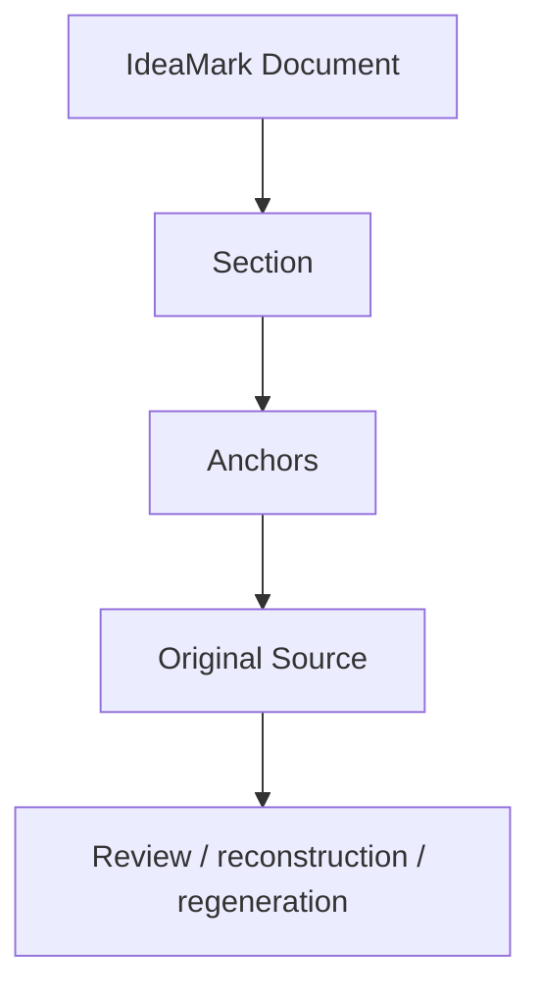

# 8. Recording Anchorage and Traceability

**Version:** IdeaMark Core v1.2.0  
**Status:** Draft

## 8.1 Purpose

Anchorage and traceability help future humans, AI systems, and tools return from an IdeaMark Document to the Original Source or source-related material.

They support review, trust, regeneration, migration, and reconstruction.

Anchorage is not only about exact citation.

It is about preserving enough return path for the intended future activity under the Projection.

## 8.2 Traceability Is Part of Reuse Design

Traceability should be designed according to reuse needs.

A lightweight draft may use approximate anchors.

A review-oriented or audit-oriented profile may require precise anchors.

A non-text source may require region, timestamp, object, or binary references.



The question is not whether every object has the strongest possible citation.

The question is whether future activity can return to the right source material with acceptable confidence.

## 8.3 Source References Before Anchors

Before recording anchors, the author should ensure that the source itself is identifiable.

A source reference may include:

- source ID;
- title;
- URI;
- repository path;
- revision or commit;
- file name;
- media type;
- document version;
- edition;
- checksum or content hash when needed.

Anchors are meaningful only when the source identity is clear enough.

## 8.4 Anchor Precision Levels

Anchor precision may vary.

Common precision levels include:

- whole source;
- heading path;
- section range;
- paragraph;
- line range;
- code symbol;
- table cell or row;
- page region;
- image region;
- audio or video timestamp;
- structured data path;
- inferred context;
- approximate context.

Core mode allows practical flexibility.

Profiles may define stricter precision requirements.

## 8.5 Section-level Anchors

Section-level anchors are often the most important anchors.

A Section represents a local activity unit.

Its anchor should identify the source context that supports that local activity unit.

This is why many documents do not need every Entity or Occurrence to carry a separate anchor.

Section-level anchoring can reduce duplication while preserving useful traceability.

## 8.6 Occurrence-level Anchors

Occurrence-level anchors may be useful when local placement depends on a specific source point.

Use them when:

- the Section covers a broad region;
- a specific sentence, line, image region, table cell, or timestamp matters;
- the Occurrence role depends on local evidence;
- review needs to approve or reject individual placements;
- multiple Occurrences in one Section refer to different source points.

Do not add Occurrence-level anchors mechanically if Section-level anchors are sufficient.

## 8.7 Entity-level Traceability

Entity-level traceability may be useful when the Entity itself is reused across Sections or documents.

For example, an Entity may be a generated label, summary, excerpt, binary reference, or derived payload.

When the Entity is derived or transformed, the author should preserve enough relationship to the source to make review possible.

Possible traceability notes include:

- direct excerpt;
- paraphrase;
- generated label;
- inferred from source context;
- external reference;
- binary payload reference;
- profile-defined transformation.

## 8.8 Approximate and Inferred Anchors

Approximate and inferred anchors are acceptable in draft or lightweight authoring.

They should be marked clearly.

Examples:

```yaml
anchors:
  - source: SRC-001
    type: heading_path
    path:
      - Discussion
    precision: approximate
    role: source_context
```

```yaml
anchors:
  - source: SRC-001
    type: image_region
    region: inferred
    precision: inferred
    role: visual_evidence_context
```

Uncertain anchoring is better than false precision.

## 8.9 Non-text Anchors

Non-text sources may need specialized anchors.

Examples:

- image coordinates or regions;
- diagram node IDs;
- video timestamps;
- audio timestamps;
- database keys;
- JSON paths;
- binary object IDs;
- external storage references;
- model artifact hashes.

Part 4 Core allows open anchor types.

Profiles may define more specific anchor schemas.

## 8.10 Traceability and Privacy

Traceability may conflict with privacy, licensing, or security requirements.

In such cases, the document may need to record references, hashes, redacted anchors, or access-controlled source IDs rather than copying source material.

Authoring should distinguish:

- source material;
- source reference;
- derived material;
- redacted material;
- access-controlled material;
- public sample material.

Part 6 provides guidance only.

Specific compliance requirements belong to profiles, policies, or implementation systems.

## 8.11 Human-AI Collaboration

AI systems may propose anchors from source context.

Humans may verify whether anchors are trustworthy enough for the intended use.

Tools may validate whether referenced source IDs exist, whether line ranges are well formed, or whether required profile anchors are present.

No fixed division of labor is required.

## 8.12 Authoring Checks

Review anchorage and traceability with questions such as:

1. Is the Original Source identifiable?
2. Can a future reviewer return to the relevant source material?
3. Are Section-level anchors sufficient?
4. Do any Occurrences need more precise anchors?
5. Do any Entities need explicit traceability notes?
6. Is uncertainty marked rather than hidden?
7. Are privacy, licensing, or access-control constraints respected?
8. Would the anchoring support regeneration or migration later?
