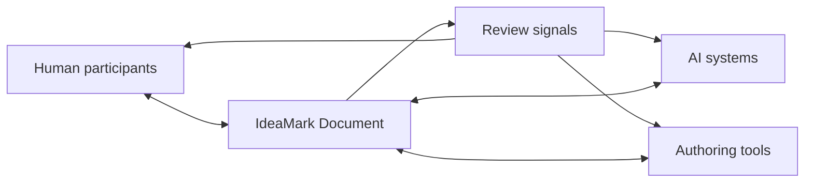

# 9. Human-AI Collaborative Authoring

**Version:** IdeaMark Core v1.2.0  
**Status:** Draft

## 9.1 Purpose

IdeaMark authoring is intended to support human-AI co-evolution.

Human authors, AI systems, tools, reviewers, and domain experts may all participate in improving an IdeaMark Document.

Part 6 does not assign fixed authoring steps to humans or AI systems.

Instead, it describes authoring activities that may be performed by different participants depending on context, capability, risk, and workflow design.

## 9.2 Collaboration Stance

Human-AI collaboration should be understood as shared improvement of knowledge reuse design.

The IdeaMark Document becomes the shared working artifact.

It allows participants to inspect, revise, validate, and reuse the same access structure.

## 9.3 Authoring Activities

Authoring may include:

- Projection selection or creation;
- source reading;
- candidate Section design;
- candidate Entity design;
- candidate Occurrence role assignment;
- anchor proposal;
- YAML drafting;
- validation;
- review;
- regeneration;
- migration;
- sample comparison;
- retrieval evaluation;
- Progressive Occurrence Resolution.

These are activities, not mandatory steps.

A lightweight authoring task may use only a few activities.

A high-assurance task may use many activities repeatedly.

## 9.4 Avoid Fixed Division of Labor

The specification should not assume that humans always decide the Projection or that AI systems always draft the document.

Possible patterns include:

- human selects Projection, AI drafts document;
- AI proposes Projection, human reviews it;
- AI drafts Sections, human revises Entity granularity;
- human writes Entities, AI proposes Occurrence roles;
- validator flags issues, AI suggests repairs, human approves;
- POR system incrementally resolves Occurrences;
- batch converter produces a draft, humans and AI systems refine it.

Future AI systems may change which activities are easy or hard.

Part 6 should remain compatible with that change.

## 9.5 Review as Communication

Review is not only error correction.

Review communicates how the IdeaMark Document should better support future reuse.

Review comments may address:

- Projection mismatch;
- Section boundary problems;
- Entity granularity;
- weak Occurrence roles;
- missing anchors;
- hidden uncertainty;
- unnecessary Relations;
- source flattening;
- over-summarization;
- missing future-use support.

Good review feedback should be actionable enough for either a human or AI system to improve the document.

## 9.6 AI Drafts Should Remain Inspectable

AI-generated IdeaMark drafts should remain inspectable as documents.

They should not depend on hidden chain-of-thought, unrecoverable session state, or tool-specific context.

If authoring context matters, record appropriate metadata, notes, Projection references, or review markers in the document or companion artifacts.

The goal is not to expose every internal reasoning step.

The goal is to preserve enough public structure for review, regeneration, and reuse.

## 9.7 Human Judgment and Accountability

Human judgment may be especially important when:

- the Projection reflects strategic or organizational intent;
- source interpretation requires domain expertise;
- legal, medical, safety, or compliance risk is present;
- privacy or licensing constraints affect source use;
- Entity granularity affects downstream decisions;
- authoring output will be reused by others at scale.

Part 6 does not mandate human review for all documents.

Profiles or implementations may require it.

## 9.8 Tool Roles

Authoring tools may support collaboration by:

- validating Core conformance;
- showing unresolved placeholders;
- comparing sample documents;
- checking reference integrity;
- detecting duplicate IDs;
- suggesting anchor improvements;
- visualizing Section / Occurrence / Entity structure;
- tracking review state;
- supporting regeneration and diff review.

These tool behaviors are outside Core conformance unless specified by a profile or tool contract.

## 9.9 Progressive Occurrence Resolution

Progressive Occurrence Resolution is one authoring method.

It may help create or refine IdeaMark Documents incrementally by resolving Occurrences in stages.

POR belongs to the authoring ecosystem.

It is not required by Core.

Part 6 may describe POR as a practical method, while Part 4 remains responsible for the document representation.

## 9.10 Collaboration Checks

Review a collaborative authoring process with questions such as:

1. Is the shared working artifact inspectable?
2. Are human and AI contributions reviewable enough?
3. Are validation signals actionable?
4. Is hidden context being relied on too heavily?
5. Does the workflow improve reuse rather than only polish text?
6. Is accountability clear enough for the risk level?
7. Can the document be regenerated or refined later?
