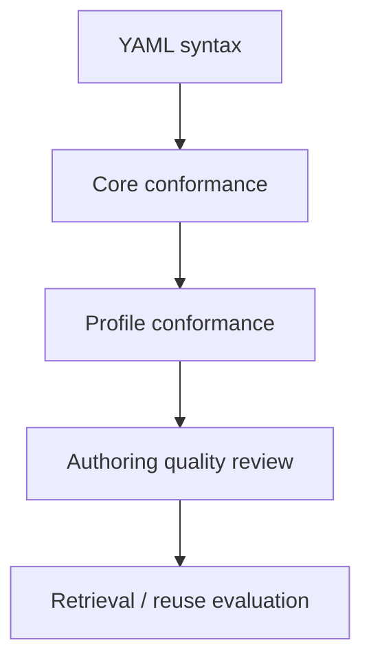
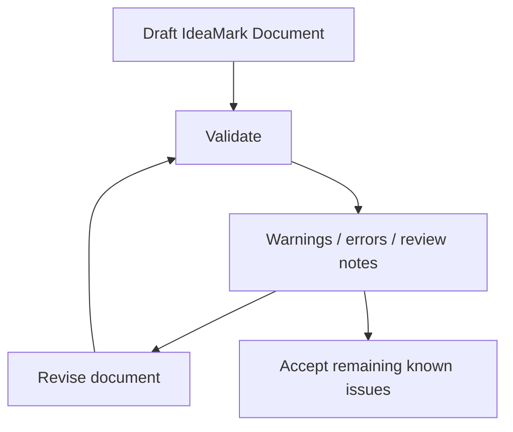

# 10. Validation and Correction Loops

**Version:** IdeaMark Core v1.2.0  
**Status:** Draft

## 10.1 Purpose

Validation and correction loops help improve IdeaMark Documents as working artifacts.

Validation is not only a final pass.

It can guide authoring, review, regeneration, migration, and profile-specific refinement.

Correction loops should improve knowledge reuse design, not merely make YAML parse successfully.

## 10.2 Validation Levels

Different validation levels may exist.

Examples:

- YAML syntax validation;
- Part 4 Core conformance;
- profile-specific constraints;
- reference integrity checks;
- authoring quality checks;
- retrieval-oriented evaluation;
- human review.

Part 4 defines Core conformance.

Part 6 describes how validation can support authoring practice.

## 10.3 Core Validation

Core validation may check:

- required top-level namespaces;
- array-based object representation;
- object IDs;
- reference integrity;
- placeholder handling;
- required common fields;
- allowed draft incompleteness;
- warning-level issues;
- serialization requirements.

Core validation should not enforce domain-specific authoring quality unless Part 4 or a profile requires it.

## 10.4 Authoring Quality Review

A document may pass Core validation and still be a weak IdeaMark Document.

Authoring quality review asks whether the document supports future reuse.

Examples:

- Does the Projection actually shape the decomposition?
- Are Sections useful local activity units?
- Are Entities reusable rather than generic summaries?
- Do Occurrence roles explain local function?
- Are anchors sufficient for review and reconstruction?
- Is uncertainty visible?
- Is the document over-extracted or under-extracted?

These checks are authoring guidance, not Core conformance by default.

## 10.5 Correction Loop Pattern

A typical correction loop may look like:

The loop may be performed by humans, AI systems, tools, or a combination of them.

A document may stop at a draft state when it is good enough for the intended use.

## 10.6 Error, Warning, and Review Signal

Not every problem should be an error.

Possible signal levels include:

- error: document cannot be parsed or violates Core requirements;
- warning: document is valid but incomplete, suspicious, or unstable;
- review: human or profile-specific judgment is needed;
- note: useful authoring information;
- accepted risk: known issue intentionally retained.

The distinction matters because IdeaMark Documents may be working artifacts.

## 10.7 AI-assisted Correction

AI systems may help correct:

- malformed YAML;
- missing IDs;
- inconsistent references;
- overly broad Entities;
- weak Section titles;
- unclear Occurrence roles;
- missing or approximate anchors;
- Projection drift;
- source flattening.

AI-assisted correction should remain inspectable.

Changes should be reviewable as document changes, not only as chat history.

## 10.8 Human Review

Human review may focus on:

- Projection intent;
- domain correctness;
- source interpretation;
- risk and accountability;
- whether reuse goals are actually supported;
- whether AI-generated structure is plausible;
- whether omissions are acceptable.

Profiles or organizations may require human approval for some document states.

Core does not require universal human review.

## 10.9 Validation and Samples

Part 4 normalized samples can seed validation and correction loops.

Implementations may use samples to test:

- parser behavior;
- formatter stability;
- reference resolution;
- warning behavior;
- round-trip behavior;
- migration from older keyed-map forms;
- profile behavior.

Sample-based validation should distinguish between syntax conformance and authoring quality.

## 10.10 Validation and Regeneration

Validation results may trigger regeneration.

For example:

- missing anchors may trigger anchor refinement;
- weak Entities may trigger Entity redesign;
- Projection drift may trigger Section reorganization;
- invalid references may trigger ID correction;
- poor retrieval results may trigger deeper re-authoring.

Regeneration should be treated as one correction method, not as a replacement for review.

## 10.11 Correction Checks

Review a validation and correction loop with questions such as:

1. Are syntax, Core conformance, profile conformance, and authoring quality separated?
2. Are errors and warnings distinguishable?
3. Are review signals actionable?
4. Can AI-assisted corrections be inspected?
5. Can humans accept known risks when appropriate?
6. Does correction improve reuse rather than only satisfy a parser?
7. Are samples available to test expected behavior?
