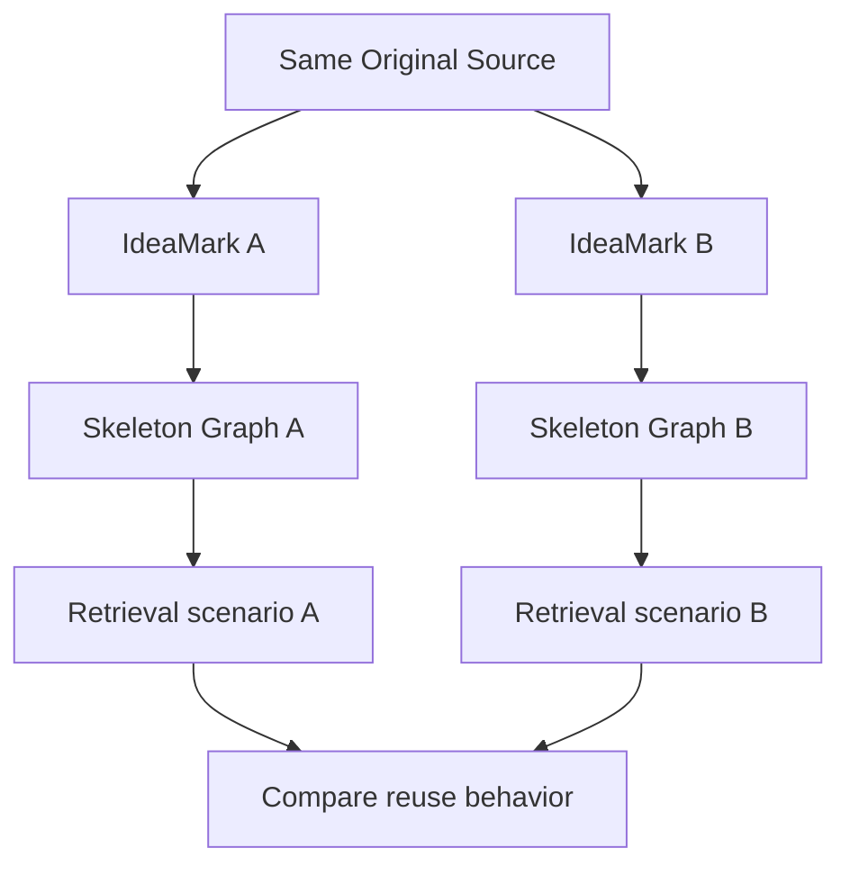

# 11. Retrieval-Oriented Evaluation

**Version:** IdeaMark Core v1.2.0  
**Status:** Draft

## 11.1 Purpose

Retrieval-oriented evaluation asks whether an IdeaMark Document supports future knowledge reuse.

It is not enough for a document to be valid YAML or to pass Core conformance.

A useful IdeaMark Document should help future humans, AI systems, and tools find, inspect, reconstruct, and activate reusable material under one or more Projections.

When Skeleton Graphs are present, evaluation should also ask whether they improve candidate retrieval without collapsing into keyword search, domain tagging, or semantic Relation graphs.

## 11.2 Reuse Is the Main Evaluation Axis

IdeaMark authoring should be evaluated primarily by reuse.

The question is not only:

```text
Is the document correct?
```

The stronger question is:

```text
Can this document help future activity reuse knowledge under the Projection?
```

This may include:

- finding the right Skeleton Graph or partial graph;
- finding the right Section;
- returning to the right source region;
- reusing an Entity in a new Section;
- reconstructing an explanation, checklist, design rationale, warning, or plan;
- comparing decompositions across Projections;
- supporting later regeneration or migration.

## 11.3 Retrieval Targets

Before evaluating retrieval, identify what future users are expected to retrieve.

Possible retrieval targets include:

- a Skeleton Graph as an activity-composition pattern;
- a Skeleton Node with a required slot;
- a Skeleton Link pattern;
- a Section as a local activity unit;
- an Occurrence with a specific role;
- an Entity of a useful kind;
- a source anchor;
- a Projection reference;
- a group of Sections in optional structure ordering;
- a warning or review marker;
- a profile-specific object.

Evaluation should be shaped by the intended future activity.

## 11.4 Evaluation Questions

Useful evaluation questions include:

1. Can a user or system find a candidate without knowing the source-specific keywords?
2. Can a use-side Projection match required Skeleton slots and links?
3. Can a user find the relevant local activity unit?
4. Can a user identify which reusable material matters?
5. Can a user return to the source region when needed?
6. Can a future AI system reconstruct a useful activation expression?
7. Does the document avoid irrelevant material that would pollute retrieval?
8. Can the same source be compared under another Projection?
9. Are placeholders, missing slots, uncertainty, and warnings visible?
10. Does the document support correction or regeneration?

## 11.5 Retrieval Scenarios

A retrieval scenario describes a future use case that the IdeaMark Document should support.

Examples:

- Explain why a data-structure implementation avoids a locally obvious optimization.
- Find API operations suitable for a fixed-size heap workflow.
- Find material for replacing an unavailable component while preserving a required effect.
- Identify ingredients that provide umami in a recipe.
- Locate recovery invariants in a state-machine design.
- Retrieve compatibility constraints from RFC-like design prose.

Scenarios help evaluate whether the authoring choices are useful.

A retrieval scenario should be tested both with source-specific vocabulary and with domain-reduced Skeleton requirements.

For example, a recipe substitution document should be tested not only with `bonito flakes`, but also with a use-side Projection that asks for:

```text
unavailable_or_blocked_element
  + preserved_effect_or_function
  + alternative_space
  + confirmation_signal
```

## 11.6 Skeleton Match Tasks

A Skeleton Match Task asks whether a use-side Projection can retrieve useful candidate structures by matching its required or preferred Skeleton Graph against document-side Skeleton Graphs.

A test case should identify:

- use-side Projection or required Skeleton Graph;
- candidate document set;
- expected matching Skeleton Graphs;
- expected matched nodes;
- expected matched links;
- missing slots that should be surfaced;
- candidate Sections, Occurrences, Entities, or anchors to pass to reconstruction;
- failure or warning conditions.

Example test shape:

```yaml
retrieval_test:
  name: function_preserving_alternative_without_source_keyword
  query_intent: replace unavailable component while preserving required effect
  required_skeleton:
    slots:
      - unavailable_or_blocked_element
      - preserved_effect_or_function
      - alternative_space
      - confirmation_signal
    links:
      - type: constraint
      - type: dependency
      - type: confirmation
  expected:
    match: partial
    matched_slots:
      - unavailable_or_blocked_element
      - preserved_effect_or_function
      - alternative_space
    missing_slots:
      - confirmation_signal
    reconstruction_policy: warning_or_review_required
```

## 11.7 Reconstruction Tasks

A reconstruction task asks a human or AI system to produce an activation expression from the IdeaMark Document and Original Source.

Examples of activation expressions:

- explanation;
- teaching note;
- warning;
- code review comment;
- migration note;
- decision memo;
- checklist;
- comparison table;
- search query;
- follow-up question.

The resulting activation expression is not necessarily stored in the IdeaMark Document.

It is generated from the reusable access structure.

When Skeleton Graphs are used, reconstruction evaluation should confirm that matched nodes lead to traceable Sections, Occurrences, Entities, or anchors and that missing slots are handled responsibly.

## 11.8 Precision and Noise

Retrieval-oriented evaluation should consider both missing material and noisy material.

A document may fail because it omits material required for reuse.

It may also fail because it includes too much material that distracts from the Projection.

A Skeleton Graph may fail because:

- it is too domain-specific;
- it is too generic to filter candidates;
- it uses link types as semantic claims rather than structural operators;
- it lacks traceable node references;
- it hides missing slots;
- it matches many irrelevant documents.

Useful omission improves retrieval.

Generic over-extraction weakens retrieval.

## 11.9 Multi-Projection Evaluation

Comparing documents generated from the same Original Source under different Projections can reveal whether the Projections and authoring choices are meaningful.



If two different Projections always produce the same retrieval behavior, the Projections may not be distinct enough or the authoring may be too generic.

If two different Projections produce different Section/Occurrence/Entity structures but indistinguishable Skeleton Graphs, the intended retrieval distinction may still be too weak.

## 11.10 Evaluation and Samples

Part 4 normalized samples can seed retrieval-oriented evaluation.

For example:

- heapq performance and heapq API design samples can test same-source/different-Projection behavior;
- recipe execution and recipe substitution samples can test non-technical source decomposition;
- SQLite pager samples can test state-machine and correctness-oriented retrieval;
- RFC design prose samples can test rationale and compatibility retrieval.

Samples should be used to test not only validators, but also authoring judgments, Skeleton Graph shape, partial matches, and reconstruction behavior.

## 11.11 Evaluation Signals

Possible evaluation signals include:

- successful Skeleton Graph match;
- failed Skeleton Graph match;
- noisy Skeleton Graph match;
- missing Skeleton slot;
- unsafe Skeleton Link pattern;
- successful retrieval;
- failed retrieval;
- noisy retrieval;
- ambiguous Section boundary;
- missing anchor;
- weak Entity granularity;
- unclear Occurrence role;
- Projection drift;
- successful reconstruction;
- reconstruction requiring too much hidden context.

These signals may become review notes, warnings, test cases, or future profile rules.

## 11.12 Authoring Checks

Review retrieval-oriented quality with questions such as:

1. What future retrieval scenario does this document support?
2. Which Skeleton Graph should be matched for that scenario?
3. Which Skeleton slots and links are required?
4. Which Sections should be found for that scenario?
5. Which Entities should be reusable?
6. Which Occurrence roles matter?
7. Can the source be revisited?
8. Does the document include too much irrelevant material?
9. Can a useful activation expression be reconstructed?
10. What failed retrievals or missing slots should become correction tasks?
