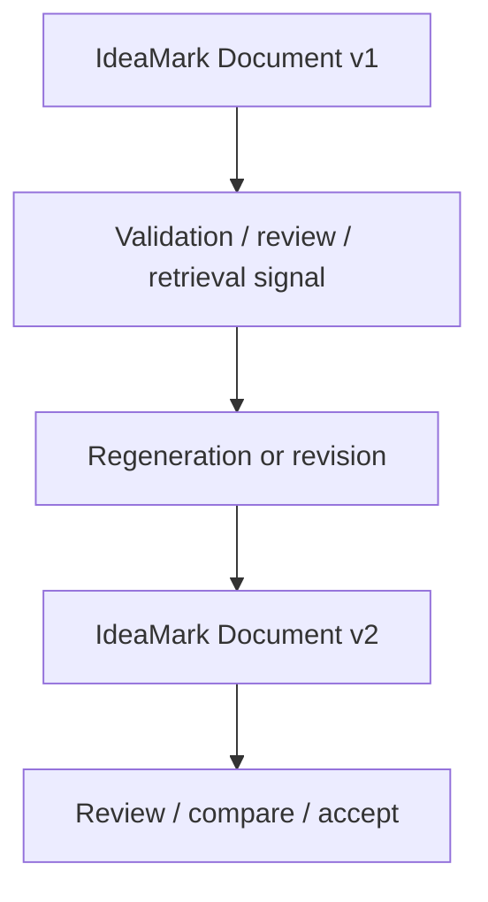

# 12. Regeneration and Versioning

**Version:** IdeaMark Core v1.2.0  
**Status:** Draft

## 12.1 Purpose

IdeaMark Documents may be working artifacts that improve over time.

Regeneration and versioning help authors revise documents while preserving traceability, reviewability, and reuse intent.

A document may be regenerated because the Projection changes, the source changes, validation finds problems, retrieval evaluation fails, or authoring tools improve.

## 12.2 Regeneration Is an Authoring Method

Regeneration is one authoring method.

It may be performed by humans, AI systems, tools, batch converters, or Progressive Occurrence Resolution systems.

Regeneration should not be treated as automatic truth replacement.

It is a revision activity that should remain reviewable.

## 12.3 Reasons to Regenerate

Common reasons include:

- Projection drift was detected;
- Entity granularity is weak;
- Section boundaries do not support reuse;
- Occurrence roles are unclear;
- anchors are missing or too approximate;
- source identity changed;
- a new source revision is available;
- a better Projection is available;
- retrieval evaluation failed;
- a profile requirement was introduced;
- migration to a new Core version is needed.

## 12.4 Versioning Stance

Versioning should preserve enough information to understand document evolution.

Core may record status and versioning metadata, but detailed lifecycle governance belongs to tools, profiles, repositories, or companion specifications.

Versioning should help answer:

- What changed?
- Why did it change?
- Which Projection shaped the change?
- Which source revision was used?
- Which validation or review signal triggered it?
- Is this version stable enough for the intended use?

## 12.5 Stable Enough, Not Final Forever

An IdeaMark Document may become stable enough for a specific use without becoming permanently final.

For example:

- stable enough for a sample corpus;
- stable enough for a validator test;
- stable enough for a local knowledge base;
- stable enough for a published profile example;
- stable enough for human review;
- stable enough for downstream retrieval evaluation.

Later reuse experience may still justify revision.

## 12.6 Comparing Versions

Version comparison should focus on reuse impact, not only textual diff.

Useful comparison questions:

- Did Section boundaries change?
- Did Entity granularity change?
- Did Occurrence roles change?
- Did anchors become more precise?
- Did the Projection change?
- Did retrieval improve?
- Did noisy material decrease?
- Did any source traceability become weaker?

A small text change may have large reuse impact.

A large formatting change may have little reuse impact.

## 12.7 Regeneration and Source Changes

If the Original Source changes, the author should decide whether the IdeaMark Document should be regenerated.

Consider:

- whether the changed source region is anchored;
- whether Entities depend on the changed region;
- whether Sections still represent useful local activity units;
- whether the Projection still applies;
- whether prior retrieval scenarios still succeed;
- whether a migration or review note is enough.

## 12.8 Regeneration and Projection Changes

Changing the Projection may require substantial re-authoring.

A Projection change can alter:

- what material is noticed;
- Section boundaries;
- Entity granularity;
- Occurrence roles;
- anchor needs;
- retrieval scenarios;
- evaluation criteria.

Authors should not assume that changing the Projection is a small metadata edit.

It may produce a different IdeaMark Document.

## 12.9 Regeneration and AI Systems

AI systems may regenerate draft documents from source, Projection, prior versions, validation reports, or review comments.

AI regeneration should preserve inspectability.

Generated changes should be reviewable through document diffs, review notes, or tool reports.

Important authoring context should be stored in the document or companion artifacts rather than only in a chat session.

## 12.10 Versioning Fields and External Systems

Part 4 may define basic metadata patterns such as status, version, generation notes, or tool identity.

Repositories, CLIs, POR systems, editors, and profile-specific tools may maintain richer version histories.

Part 6 should not require one universal lifecycle system.

## 12.11 Authoring Checks

Review regeneration and versioning with questions such as:

1. Why is regeneration needed?
2. Which signal triggered the change?
3. Did the Projection change?
4. Did source identity or revision change?
5. Did reuse quality improve?
6. Are differences reviewable?
7. Is the new document stable enough for the intended use?
8. Should the previous version remain available as design history?
