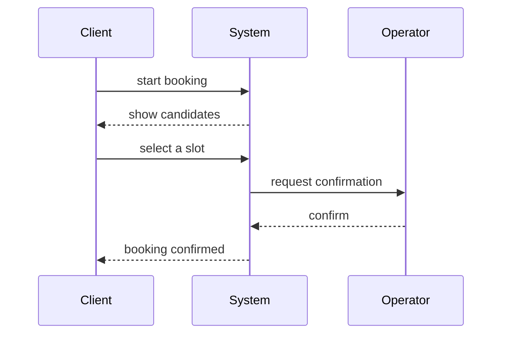

# WorkCell Service Flow Template

本テンプレートは、WorkCellが提供するサービスを、**画面遷移より上位**の「意味的な流れ」として定義する。  
ここで定義するのは **UIではなく、アクターが何をどう達成するか**（ユースケース／シーケンス／フロー）である。

- **このテンプレートが“正”**：Actors / Flows / State / Hooks（意味構造）
- Mermaid等の図は **任意（派生・説明）** とし、ズレた場合は意味構造を正として修正する

---

## Template Scope

### Suitable for
- WorkCellのサービス提供フロー（予約、受付、承認、記録、通知、集計、申請など）の定義
- Decision6 WorkCell Template の `Experiment.scope` を具体化する前提フロー
- 観測点（ログ/メトリクス）を設計に織り込むケース

### Not responsible for
- 画面UI詳細（画面項目、遷移図のピクセルレベル）
- API詳細仕様（エンドポイント、スキーマ）
- DB物理設計（型、索引）
- インフラ詳細（SLO、構成図、IaC）

これらは別テンプレートで定義し、本テンプレートから `refs` で参照する。

---

# Flow Definition (Required Sections)

## Meta
```yaml
flow_id: "<stable id, e.g. flow.relatea.booking.v1>"
title: "<flow title>"
lang: "ja-JP"
scope: ["<capability-1>", "<capability-2>"]
derived_from: []
refs: []
```
- `flow_id` は安定ID（バージョンを含めるのを推奨）
- `scope` はこのフローがカバーする能力の範囲

---

## Actors
```yaml
actors:
  - id: "actor.client"
    name: "Client"
    role: "サービス利用者"
  - id: "actor.operator"
    name: "Operator"
    role: "提供者/管理者"
  - id: "actor.system"
    name: "System"
    role: "WorkCell（自動化部分）"
```
- アクターは人・組織・外部システムを含む
- 後続のフローでは `id` を参照して記述する

---

## Goals
```yaml
goals:
  - id: "goal.client.book"
    actor: "actor.client"
    statement: "予約を確定したい"
  - id: "goal.operator.reduce_admin"
    actor: "actor.operator"
    statement: "事務負荷を減らしたい"
```
- Goal は「そのアクターが達成したいこと」を短文で書く
- 1 Flow は複数 Goal を持って良い

---

## Preconditions & Triggers
```yaml
preconditions:
  - "ユーザーが連絡可能（例: LINE友だち登録済み）"
triggers:
  - id: "trigger.client.starts"
    actor: "actor.client"
    event: "予約開始"
```
- Preconditions は “始める前提”
- Trigger は “始まるきっかけ（イベント）”

---

## Main Flow
```yaml
main_flow:
  - step_id: "S1"
    actor: "actor.client"
    action: "予約開始を選択する"
    system: "予約導線を提示する"
    outputs: ["event.booking.started"]
    state_transition: {entity: "booking", from: "none", to: "draft"}

  - step_id: "S2"
    actor: "actor.system"
    action: "候補枠を提示する"
    outputs: ["event.booking.candidates_shown"]
    state_transition: {entity: "booking", from: "draft", to: "pending"}

  - step_id: "S3"
    actor: "actor.client"
    action: "候補を選択する"
    outputs: ["event.booking.selected"]

  - step_id: "S4"
    actor: "actor.operator"
    action: "確定する（または自動確定）"
    outputs: ["event.booking.confirmed"]
    state_transition: {entity: "booking", from: "pending", to: "confirmed"}
```
- **Main Flow はこのテンプレの核**（後段のUI/API/DBの元になる）
- `outputs` は観測可能なイベント（Hooksに接続）
- `state_transition` は最小の状態遷移（State Modelに接続）
- `system` は「システムが返すこと」を明示したい場合の補助（任意）

---

## Alternative Flows
```yaml
alternative_flows:
  - alt_id: "A1"
    when: "候補が合わない"
    from_step: "S2"
    steps:
      - step_id: "A1-1"
        actor: "actor.client"
        action: "別候補を要求する"
        outputs: ["event.booking.more_candidates_requested"]
```
- Alternative は「正常系の分岐」
- `from_step` でメインフローの分岐点に紐づける

---

## Exception Flows
```yaml
exception_flows:
  - ex_id: "E1"
    when: "一定時間返信がない"
    detection: "timeout:PT24H"
    handling: "予約を無効化し、再開導線を提示する"
    outputs: ["event.booking.timeout"]
    state_transition: {entity: "booking", from: "pending", to: "canceled"}
```
- Exception は「失敗・逸脱・異常」
- `detection` は検知条件を具体に（タイムアウト等）

---

## State Model (Minimal)
```yaml
state_model:
  entity: "booking"
  states: ["draft", "pending", "confirmed", "done", "canceled"]
  transitions:
    - {from: "draft", to: "pending", by: "event.booking.candidates_shown"}
    - {from: "pending", to: "confirmed", by: "event.booking.confirmed"}
    - {from: "confirmed", to: "done", by: "event.session.done"}
```
- フローに必要な最小限の状態だけを置く
- 詳細な状態は別テンプレ（State/Domain）に切り出して良い

---

## Observability Hooks
```yaml
hooks:
  - id: "hook.booking.started"
    event: "event.booking.started"
    intent: "ファネル計測（開始点）"
    recommended_fields: ["timestamp", "actor_id_hash", "channel", "flow_id"]

  - id: "hook.booking.confirmed"
    event: "event.booking.confirmed"
    intent: "完了率計測（確定）"
    recommended_fields: ["timestamp", "booking_id", "slot_id"]
```
- Hooks は、Decision6 の Metric と接続するための“観測設計”
- ここを決めると「測れないから決められない」が減る

---

## References (to Detail Templates)
```yaml
refs:
  - id: "ref.ui.flow.booking"
    kind: "ideamark_doc"
    title: "UI設計（画面項目・遷移）"
    locator: "internal://ideamark/ui.booking.v1"
  - id: "ref.api.booking"
    kind: "ideamark_doc"
    title: "API設計（スキーマ）"
    locator: "internal://ideamark/api.booking.v1"
  - id: "ref.db.booking"
    kind: "ideamark_doc"
    title: "DB設計（論理/物理）"
    locator: "internal://ideamark/db.booking.v1"
  - id: "ref.infra.workcell"
    kind: "ideamark_doc"
    title: "Infra設計（運用/SLO）"
    locator: "internal://ideamark/infra.workcell.v1"
```
- 詳細テンプレ群への接続点
- `kind` は自由だが、少なくとも `title/locator` は持つ

---

# Renderings (Optional)

以下は **任意の説明**。正は上の意味構造である。  
Mermaid はズレやすいので、生成・更新の責務を明確にする。

## Rendering Meta (Optional)
```yaml
renderings:
  - id: "render.seq.v1"
    type: "mermaid.sequence"
    generated_from: "<flow_id>@<hash or version>"
    note: "ズレた場合は Flow Definition を正として更新する"
```

## Mermaid Sequence Diagram (Optional)

