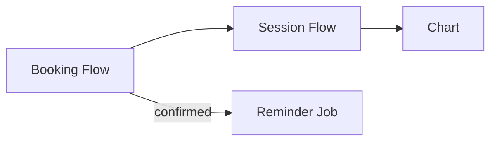

# WorkCell Integration Spec

本Specは、複数の Service Flow を **一つの WorkCell として整合**させるための統合仕様である。  
**正（source of truth）**は Decision6 と各 Service Flow の Ideamark だが、Detail（UI/API/DB/Infra）に進む前に、
- 共通語彙（ID/用語/Event/State）
- 競合点
- 解決方針（優先順位・修正先）
をここで固定する。

---

## 0. Provenance（参照元の明確化）【必須】

このSpecが **どのバージョン／どのファイル**に基づくかを、機械可読に記録する。  
（将来、ロジック処理エンジンで自動生成・差分検出するための最重要セクション）

```yaml
provenance:
  spec_id: "<stable id, e.g. integ.relatea.v1>"
  created_by: "<human or tool>"
  created_at: "<ISO-8601 datetime>"
  method: "manual|engine|hybrid"
  based_on:
    decision6:
      - doc_id: "<Decision6 doc_id>"
        template_ref: "<template ref>"
        version: "<doc version if encoded>"
        locator: "<path/uri>"
        content_hash: "<optional: sha256 of file content>"
    flows:
      - doc_id: "<Flow doc_id>"
        flow_id: "<flow_id>"
        template_ref: "<template ref>"
        locator: "<path/uri>"
        content_hash: "<optional: sha256>"
      - doc_id: "<Flow doc_id>"
        flow_id: "<flow_id>"
        template_ref: "<template ref>"
        locator: "<path/uri>"
        content_hash: "<optional: sha256>"
  notes:
    - "content_hash は将来の差分検知で使う（なくてもよいが推奨）"
```

---

## 1. Integration Goals（統合の目的）【必須】

```yaml
integration_goals:
  - "複数フローに跨る状態・イベント・IDの整合を取る"
  - "競合点を列挙し、優先順位とトレードオフをDecisionとして固定する"
  - "Detail設計（UI/API/DB/Infra）へ共通ルールを配布する"
```

---

## 2. Canonical Vocabulary（共通語彙）【必須】

### 2.1 Canonical IDs / Entities
```yaml
canonical_entities:
  - name: "client"
    id_field: "client_id"
    description: "顧客"
  - name: "trainer"
    id_field: "trainer_id"
    description: "トレーナー"
  - name: "booking"
    id_field: "booking_id"
    description: "予約（枠と顧客の紐づき）"
  - name: "session"
    id_field: "session_id"
    description: "当日の実施単位（bookingに紐づく）"
  - name: "chart"
    id_field: "chart_id"
    description: "セッション記録"
relations:
  - "booking -> session (0..1 or 1..1)"
  - "session -> chart (0..1)"
```
- ここで “同じ概念に別IDがある” を潰す。
- 以後の Detail はこの語彙に従う。

### 2.2 Terminology Mapping（同義語・別名のマッピング）
```yaml
term_map:
  - canonical: "client"
    aliases: ["user", "customer"]
  - canonical: "chart"
    aliases: ["record", "note", "karte"]
```

---

## 3. Event Catalog（イベントカタログ）【必須】

各 Service Flow の `outputs` / `hooks` を統合し、イベントの意味を固定する。

```yaml
event_catalog:
  - event: "event.booking.started"
    producer: ["flow.relatea.booking.v1"]
    consumers: ["metrics.booking_completion"]
    required_fields: ["timestamp", "client_id_hash", "flow_id"]
    description: "予約導線の開始"

  - event: "event.booking.confirmed"
    producer: ["flow.relatea.booking.v1"]
    consumers: ["metrics.booking_completion", "jobs.reminder"]
    required_fields: ["timestamp", "booking_id", "slot_id"]
    description: "予約確定"

  - event: "event.session.checkin"
    producer: ["flow.relatea.checkin-chart-done.v1"]
    consumers: ["metrics.checkin_rate"]
    required_fields: ["timestamp", "booking_id", "session_id"]
    description: "来店（チェックイン）"

  - event: "event.session.done"
    producer: ["flow.relatea.checkin-chart-done.v1"]
    consumers: ["metrics.session_done_rate", "charts.prompt"]
    required_fields: ["timestamp", "session_id", "trainer_id"]
    description: "セッション終了"
```
**ルール**：同名イベントが複数フローで異なる意味を持つ場合、必ず衝突として扱い（後述）、解決する。

---

## 4. State Integration（状態統合）【必須】

フローごとの `state_model` を統合して、WorkCellとして矛盾しない状態機械にする。

```yaml
state_integration:
  - entity: "booking"
    canonical_states: ["draft", "pending", "confirmed", "canceled", "done"]
    invariants:
      - "confirmed になった booking は session に 1..1 で対応する（または遅延生成ルールを定める）"
      - "booking.done は session.done を前提とする"
    derived_from_flows:
      - "flow.relatea.booking.v1"
      - "flow.relatea.checkin-chart-done.v1"

  - entity: "session"
    canonical_states: ["scheduled", "in_progress", "done", "canceled", "no_show"]
    invariants:
      - "session.done は booking.confirmed を前提とする"
    derived_from_flows:
      - "flow.relatea.checkin-chart-done.v1"
```

---

## 5. Conflict Register（競合点一覧）【必須】

競合は「見つけたら必ず記録」し、解決はDecisionとして残す。

### 5.1 Conflict Types（分類）
- **State conflict**：状態遷移が噛み合わない
- **Event conflict**：同名イベントの意味が違う／粒度が違う
- **Data conflict**：同一概念のID/属性がズレる
- **Auth conflict**：権限・責務がズレる
- **Ops conflict**：ジョブ・キュー・時刻依存の衝突

### 5.2 Conflicts
```yaml
conflicts:
  - id: "C-001"
    type: "state"
    summary: "booking.done の定義がフロー間で曖昧"
    detected_in: ["flow.relatea.booking.v1", "flow.relatea.checkin-chart-done.v1"]
    impact: "DB/API/UIすべてに波及"
    proposed_fixes:
      - "booking.done は session.done 発生で遷移する、と統一"
      - "booking と session を 1..1 にし、session を必ず生成"
    priority: "P0"
    status: "open|resolved"
```

---

## 6. Resolution Decisions（解決方針：意思決定）【必須】

Decision6 の優先軸（M-REL-001/002/003等）を踏まえ、競合をどう解くかを固定する。

```yaml
resolution_decisions:
  - decision_id: "RD-001"
    conflict_id: "C-001"
    decision: "booking.done は session.done をもって確定し、bookingは session を必ず参照する"
    rationale:
      - "計測（完了率・実施率）を安定させる"
      - "Flowの意味を単純化し、UI/API/DBの手戻りを減らす"
    tradeoffs:
      - "session生成タイミングの実装が必要（confirm時 or check-in時）"
    change_targets:
      - {doc: "flow.relatea.booking.v1", change: "state_model transition confirmed->done の条件を session.done に統一"}
      - {doc: "flow.relatea.checkin-chart-done.v1", change: "session と booking の関連を明記"}
    status: "approved|tentative"
```

---

## 7. Detail Design Hand-off（Detailへ渡す共通ルール）【必須】

UI/API/DB/Infra が “全事情” を踏まえるための、最小の共通制約をここに集約する。

```yaml
handoff:
  ui_rules:
    - "フローの step_id と画面/操作を対応づける（traceability）"
  api_rules:
    - "イベントカタログの required_fields を満たす入力/出力を担保する"
  db_rules:
    - "canonical_entities の id_field を主キー/外部キーの基準とする"
  infra_rules:
    - "jobs.reminder は event.booking.confirmed をトリガにする"
    - "timeout は state と event として必ず残す（監査性）"
refs_to_detail:
  - {id: "ref.ui", kind: "ideamark_doc", locator: "<ui-doc-uri>"}
  - {id: "ref.api", kind: "ideamark_doc", locator: "<api-doc-uri>"}
  - {id: "ref.db", kind: "ideamark_doc", locator: "<db-doc-uri>"}
  - {id: "ref.infra", kind: "ideamark_doc", locator: "<infra-doc-uri>"}
```

---

## 8. Change Log（このSpec自体の更新履歴）【推奨】

```yaml
change_log:
  - at: "<ISO-8601>"
    by: "<human/tool>"
    change: "Added event catalog baseline"
    based_on_update: ["flow.relatea.booking.v1"]
```

---

# Renderings (Optional)

統合は図にするとレビューが速い。以下は任意（派生）で、正は上の意味構造。

```yaml
renderings:
  - id: "render.integration.flowmap.v1"
    type: "mermaid.flowchart"
    generated_from: "<spec_id>@<hash>"
```



